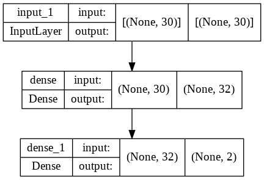
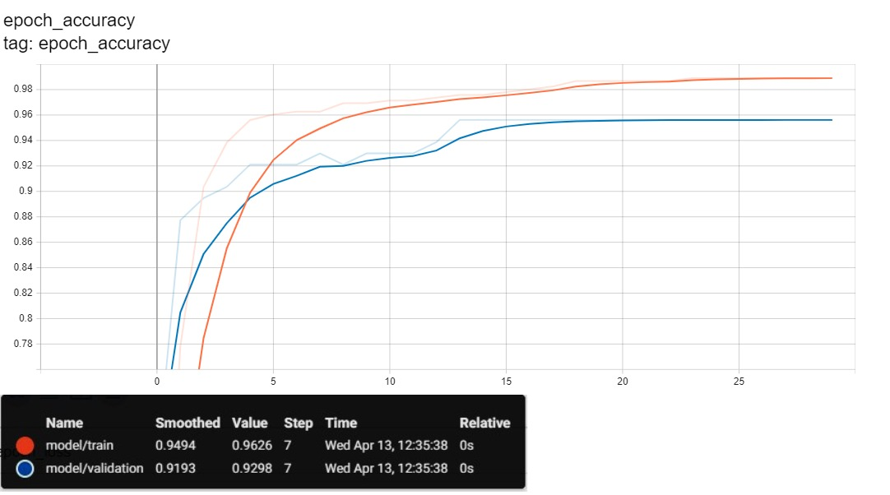
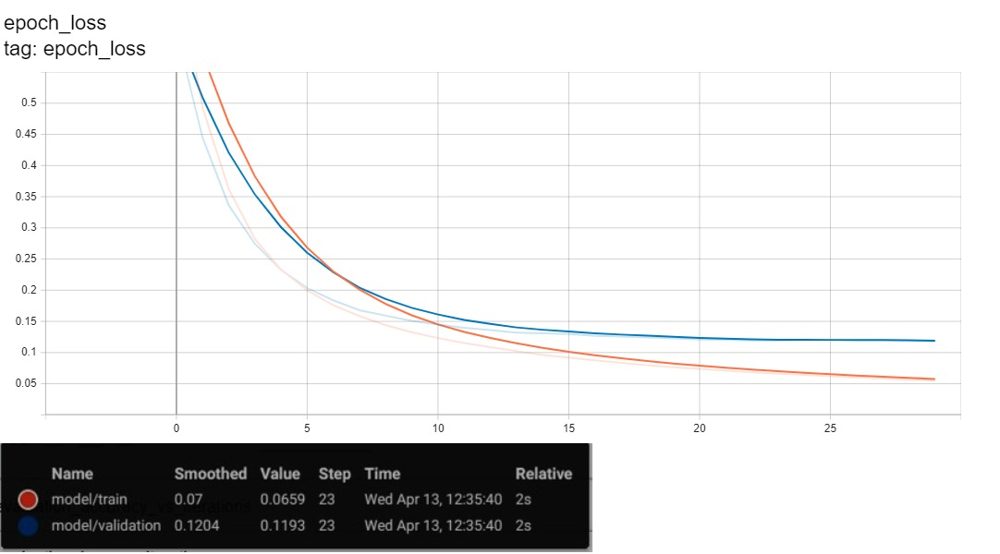

# Breast Cancer Detection <a href="https://htmlpreview.github.io/?https://raw.githubusercontent.com/SarahHannes/breast-cancer-detection/main/breast_cancer_detection.html">[Code]</a>

Breast cancer detection using simple feedforward neural network.

## Data preprocessing

- Feature normalization using RobustScaler from Sklearn
- One hot encoding for label columns

## Model architecture

- Input layer + 1 Dense hidden layer + 1 Dense output layer
- Trained for 30 epochs
- Last validation accuracy 95%

